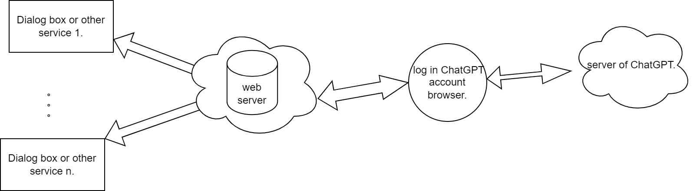

# browser-chatgptapi

[中文简体](README_ZH.md)

By injecting js scripts into the browser OpenAI ChatGPT page, ChatGPT on the web page is turned into an API that supports multiple simultaneous connections

**How to use**: [How to use?](wiki/how-to-use.md)

**Recommended Magic Network**: [click this link to have a monthly $1 discount package](https://xx025.github.io/773ycd9u.html)

### Implementation idea.

Build a message forwarding server, and complete communication with the server by injecting scripts into the browser ChatGPT page. The message forwarding server allows multiple users to connect, and queries raised by the user are queued and processed in order and returned to the user.

### Demonstration.

**Demo video**: [YouTube](https://www.youtube.com/embed/o4SETVDbaEY)

### Architecture diagram

### Finally

**The code is relatively rudimentary, there is much room for improvement, welcome to participate in the development together**

*These translations come from deepl*

