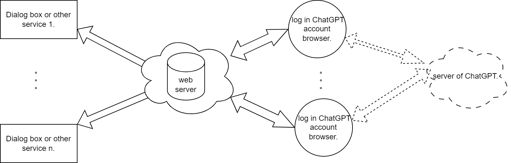

# browser-chatgptapi

通过向浏览器OpenAI ChatGPT页面注入js脚本的方式，将网页上的ChatGPT变成一个API，支持多人同时连接,连接多个ChatGPT账户

### 实现思路：

构建一个消息转发服务器，通过向浏览器ChatGPT页面注入脚本完成与服务器的通信，消息转发服务器允许多个用户进行连接，并且用户提出的查询进行排队依次处理并返回给用户。


## 快速开始

1. 运行web服务

    ```shell
    git clone -b master https://github.com/xx025/browser-chatgptapi.git
    cd browser-chatgptapi
    pip install virtualenv
    virtualenv venv
    pip install -r requirements.txt
    python run.py
    ```

   此时web服务正在允许，他有两个重要的接口

    - `ws://localhost:8010/user` 供用户连接
    - `ws://localhost:8010/server` 供chatgpt服务连接

2. 连接chatgpt服务

   将脚本[ChatGptPagesScripts.js](../ChatGptPagesScripts.js),导入如脚本管理器如`Tampermonkey`

   打开OpenAI [ChatGPT官网](https://chat.openai.com/chat) 登录账号

   正常登陆后通过注入的脚本，将会连接到web服务，当然你有的话，可以在浏览器中创建多个窗口登录多个账号

   考虑到web服务与登录chatgpt账号的浏览器不在一个机器上，会出现`MixedContent`
   错误，请查看[StackFlow](https://stackoverflow.com/questions/18321032)对此问题的解决方案

   另外考虑到`/server`路径的安全问题，可在`setting.py`中设置更复杂的token，并将其写入js脚本中、


3. 进行测速

   我写了一个简单的测速页面你可以打开一个或多个`http://localhost:8010/` 进行测速，你可以用postman打开一个或多个WebSocket API测速页面进行测式，在`setting.py`你可以设置最大的用户连接数
   


### 演示：

**演示视频**：[YouTube](https://www.youtube.com/watch?v=dis8NDfT16I)


### 架构图



### 最后

**代码比较简陋，可完善之处多多，欢迎参与一起开发**